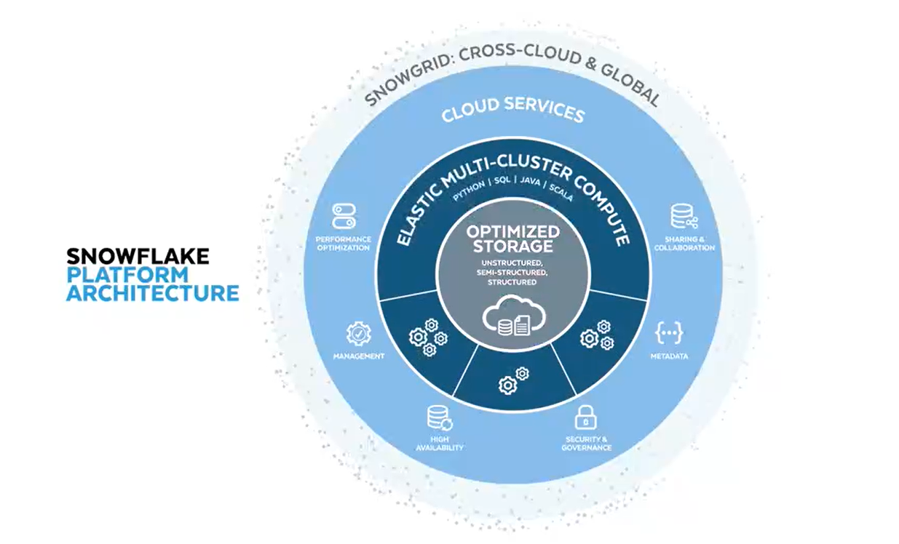
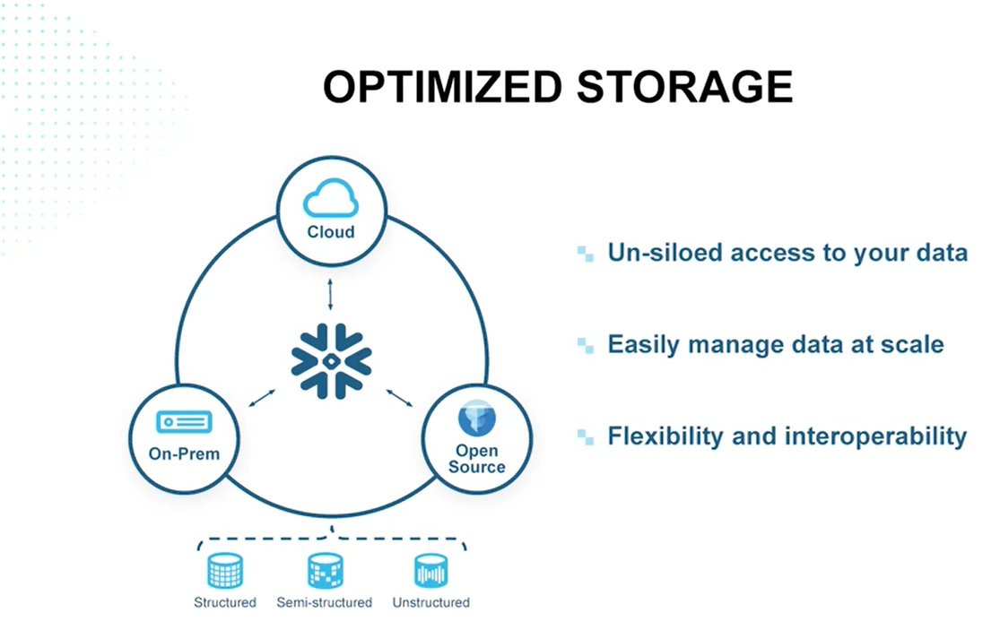
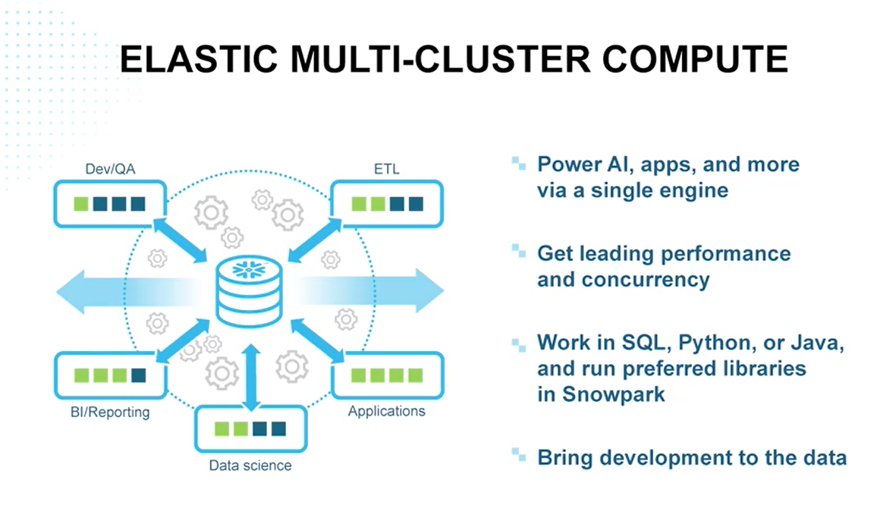
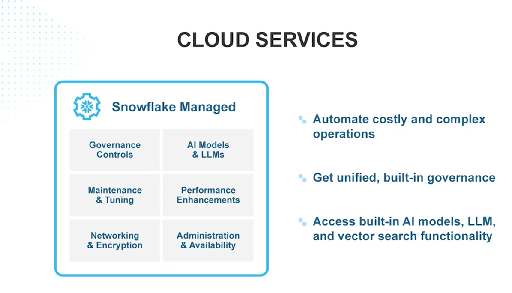
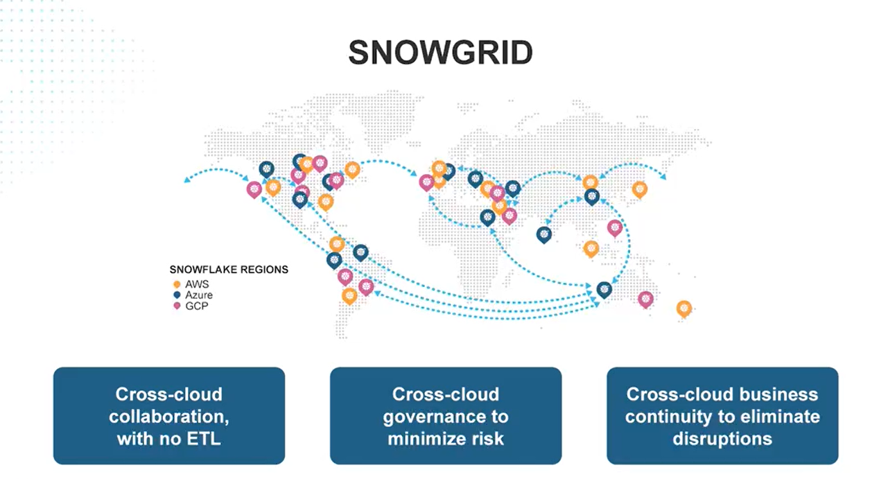

## Snowflake Architecture
Snowflake has four layer architecture.
1. Optimized Storage
1. Elastic Multi-Cluster Compute
1. Cloud Services
1. SnowGrid: Cross-Cloud & Global

## Optimized Storage
The first layer is optimized storage. You can access your data all in one place. It gives you the ability to store structured data, high volume, semi structured JSON data, even unstructured data like PDF's or images. This layer is built on blob storage, which is great because that means you don't have to migrate your data as it grows. Snowflake manages the data. So for example, it automatically controls the micro partitioning. It takes care of compression. It takes care of encryption. And the storage is flexible. So you can use the architecture you want. You can connect with data on premises, data stored in open table formats like Apache, iceberg, etc.

## Elastic Multi-Cluster Compute
Snowflake's second layer is its elastic, multi-cluster compute. It separates storage and compute, both of which are near-infinitely scalable. A key advantage is that it also separates compute from compute, allowing multiple compute clusters to operate on the same data simultaneously without resource contention (as seen with virtual warehouses). Snowflake further enhances flexibility by supporting multiple languages, including SQL, Python, and Java, Scala etc.

## Cloud Services
The third layer, cloud services, handles many crucial tasks. It automatically pushes upgrades without requiring migrations or causing downtime, meaning Snowflake engineers can continuously enhance platform performance, and those improvements seamlessly benefit you. The cloud services layer also manages files and file metadata, enabling ACID transactions, query result caching, time travel, zero copy cloning, which we'll learn about later, and high concurrency.

## SnowGrid
The fourth layer is Snowgrid, which lets businesses connect across regions and cloud providers. It is mentioned at the beginning of the course, Snowflake works on Amazon Web Services (AWS), Microsoft Azure, and Google Cloud (GCP). Snowgrid makes data services and apps accessible. These can be distributed between teams, business units, partners, and customers, and it removes the need for extra ETL ELT and integrations. You're also able to maintain business continuity, cross region and cross cloud. You can replicate and synchronize databases, accounts, pipelines, and more. Snowgrid allows for resiliency, durability, and failover by choice, and it even lets you migrate between clouds as needed.

