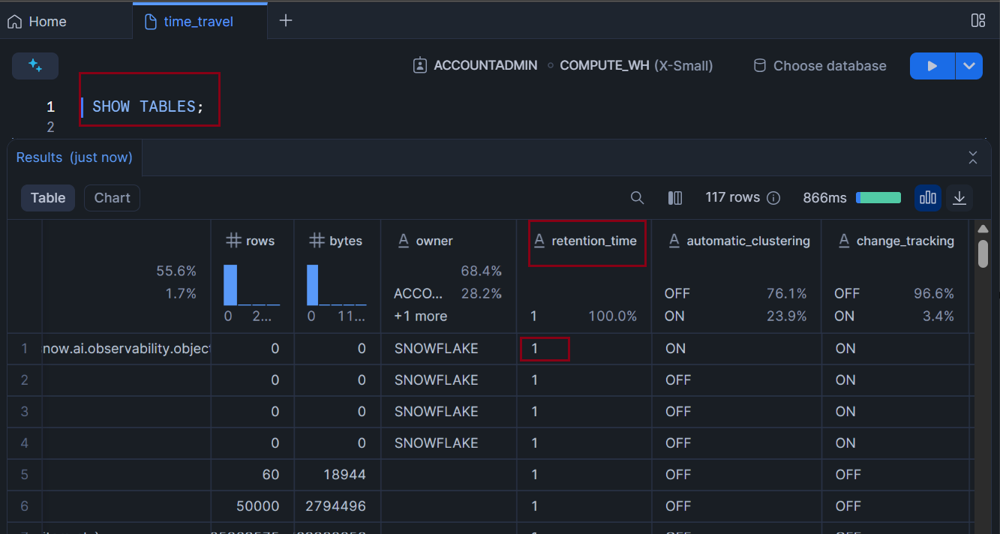

# Time Travel

Time travel feature in snowflake is a data recovery and uncover feature. It lets you to access data in the past by traversing back in time based on data retention time set for your table.

You can go back in time by following ways.
1. Particular timestamp
1. No of seconds from current date time
1. Before a query id

## Data Retention Period
Snowflake has default retention period of 1 day. You can find that out by using ```SHOW TABLES``` command. Retention time decides how many days Snowflake keeps track of changes to data in a table. Refer to below screenshot.



You can increase this value upto 90 days for Enterprise Edition of Snowflake by using ALTER command. 

```SQL
ALTER TABLE TASTY_BYTES.RAW_POS.truck_dev SET DATA_RETENTION_TIME_IN_DAYS = 90;
```

## Time Travel Based on Timestamp
You can query data in a table in the past at a certain time. You can refer to below example to understand how this is done.

```SQL
CREATE OR REPLACE TABLE tasty_bytes.raw_pos.truck_dev 
    CLONE tasty_bytes.raw_pos.truck;

SELECT
    t.truck_id,
    t.year,
    t.make,
    t.model
FROM tasty_bytes.raw_pos.truck_dev t;
    
---> see how the age should have been calculated
SELECT
    t.truck_id,
    t.year,
    t.make,
    t.model,
    (YEAR(CURRENT_DATE()) - t.year) AS truck_age
FROM tasty_bytes.raw_pos.truck_dev t;

---> record the time, back when the data was still correct
SET good_data_timestamp = CURRENT_TIMESTAMP;

---> view the variable’s value
SELECT $good_data_timestamp;

---> confirm that that worked
SHOW VARIABLES;

---> make the first mistake: calculating the truck’s age incorrectly
SELECT
    t.truck_id,
    t.year,
    t.make,
    t.model,
    (YEAR(CURRENT_DATE()) / t.year) AS truck_age
FROM tasty_bytes.raw_pos.truck_dev t;

---> make the second mistake: calculate age wrong, and overwrite the year!
UPDATE tasty_bytes.raw_pos.truck_dev t
    SET t.year = (YEAR(CURRENT_DATE()) / t.year);

SELECT
    t.truck_id,
    t.year,
    t.make,
    t.model
FROM tasty_bytes.raw_pos.truck_dev t;

---> select the data as of a particular timestamp
SELECT * FROM tasty_bytes.raw_pos.truck_dev
AT(TIMESTAMP => $good_data_timestamp);

SELECT $good_data_timestamp;

---> example code, without a timestamp inserted:

-- SELECT * FROM tasty_bytes.raw_pos.truck_dev
-- AT(TIMESTAMP => '[insert timestamp]'::TIMESTAMP_LTZ);

--->example code, with a timestamp inserted
SELECT * FROM tasty_bytes.raw_pos.truck_dev
AT(TIMESTAMP => '2025-06-17 14:34:31.833 -0700'::TIMESTAMP_LTZ);
```

Here AT(TIMESTAMP => '2025-06-17 14:34:31.833 -0700'::TIMESTAMP_LTZ) is used to perform time travel.

## Time Travel based on No of seconds from current date time
Similar to time travel at a particular timestemp you can specify the no of seconds from now when you would like to query snapshot of data in table. Refer to below example.

```SQL
CREATE OR REPLACE TABLE tasty_bytes.raw_pos.truck_dev 
    CLONE tasty_bytes.raw_pos.truck;

SELECT
    t.truck_id,
    t.year,
    t.make,
    t.model
FROM tasty_bytes.raw_pos.truck_dev t;
    
---> see how the age should have been calculated
SELECT
    t.truck_id,
    t.year,
    t.make,
    t.model,
    (YEAR(CURRENT_DATE()) - t.year) AS truck_age
FROM tasty_bytes.raw_pos.truck_dev t;


---> record the time, back when the data was still correct
SET good_data_timestamp = CURRENT_TIMESTAMP;

---> confirm that it worked
SHOW VARIABLES;

---> make the first mistake: calculating the truck’s age incorrectly
SELECT
    t.truck_id,
    t.year,
    t.make,
    t.model,
    (YEAR(CURRENT_DATE()) / t.year) AS truck_age
FROM tasty_bytes.raw_pos.truck_dev t;

---> make the second mistake: calculate age wrong, and overwrite the year!
UPDATE tasty_bytes.raw_pos.truck_dev t
    SET t.year = (YEAR(CURRENT_DATE()) / t.year);

SELECT
    t.truck_id,
    t.year,
    t.make,
    t.model
FROM tasty_bytes.raw_pos.truck_dev t;


SELECT $good_data_timestamp;


---> calculate the right offset
SELECT TIMESTAMPDIFF(second,CURRENT_TIMESTAMP,$good_data_timestamp);

---> Example code, without an offset inserted:

-- SELECT * FROM tasty_bytes.raw_pos.truck_dev
-- AT(OFFSET => -[WRITE OFFSET SECONDS PLUS A BIT]);

---> select the data as of a particular number of seconds back in time
SELECT * FROM tasty_bytes.raw_pos.truck_dev
AT(OFFSET => -45);
```

Here AT(OFFSET => -45) performs the time travel based no of seconds offset.

## Time Travel based on Before a query id
If you want to query a table before a certain query was executed you can use this technique. In Snowflake each query executed has a unique no. So, this query id can be saved and used in the time travel expression to fetch data before that query is executed. You can refer to below example commands to understand it.

```SQL
CREATE OR REPLACE TABLE tasty_bytes.raw_pos.truck_dev 
    CLONE tasty_bytes.raw_pos.truck;

SELECT
    t.truck_id,
    t.year,
    t.make,
    t.model
FROM tasty_bytes.raw_pos.truck_dev t;
    
---> see how the age should have been calculated
SELECT
    t.truck_id,
    t.year,
    t.make,
    t.model,
    (YEAR(CURRENT_DATE()) - t.year) AS truck_age
FROM tasty_bytes.raw_pos.truck_dev t;

---> record the most recent query_id, back when the data was still correct
SET good_data_query_id = LAST_QUERY_ID();

---> view the variable’s value
SELECT $good_data_query_id;

---> confirm that that worked
SHOW VARIABLES;

---> make the first mistake: calculating the truck’s age incorrectly
SELECT
    t.truck_id,
    t.year,
    t.make,
    t.model,
    (YEAR(CURRENT_DATE()) / t.year) AS truck_age
FROM tasty_bytes.raw_pos.truck_dev t;

---> make the second mistake: calculate age wrong, and overwrite the year!
UPDATE tasty_bytes.raw_pos.truck_dev t
    SET t.year = (YEAR(CURRENT_DATE()) / t.year);

SELECT
    t.truck_id,
    t.year,
    t.make,
    t.model
FROM tasty_bytes.raw_pos.truck_dev t;


SELECT $good_data_query_id;

---> select the data as of its state before a previous query was run
SELECT * FROM tasty_bytes.raw_pos.truck_dev
BEFORE(STATEMENT => $good_data_query_id);
```

Here BEFORE(STATEMENT => $good_data_query_id) statement performs the time travel.