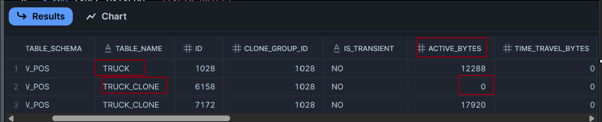

# Cloning
Snowflake performs zero copy cloning. Let's understand how it is done through examples. Let's perform a cloning by using below query.

```SQL 
CREATE OR REPLACE TABLE tasty_bytes.raw_pos.truck_clone 
CLONE tasty_bytes.raw_pos.truck;
```

Use below query to find out metrics of the tables TRUCK, TRUCK_CLONE

```SQL
SELECT * FROM TASTY_BYTES.INFORMATION_SCHEMA.TABLE_STORAGE_METRICS
WHERE (TABLE_NAME = 'TRUCK_CLONE' OR TABLE_NAME = 'TRUCK')
AND TABLE_CATALOG = 'TASTY_BYTES';
```
The output of the above query will contain a colum "ACTIVE_BYTES". You can note that the value is zero for TRUCK_CLONE table. "CLONE_GROUP_ID" column tracks the ID of the table from which a able is cloned. In this case CLONE_GROUP_ID for TRUCK_CLONE is that of TRUCK which is 1028



## Tables view
You can use tables view to find metrics about the table using below query.

```SQL
SELECT * FROM TASTY_BYTES.INFORMATION_SCHEMA.TABLES
WHERE TABLE_NAME = 'TRUCK_CLONE' OR TABLE_NAME = 'TRUCK';
```

This view gets updated frequently. It will show how much size in byte the table has. TRUCK_CLONE table has 12288 byte

## Cloning Other Database Object
You can use the same syntax to clone other object similar to table. You can use below query to clone a schema and database respectively.

```SQL
---> clone a schema
CREATE OR REPLACE SCHEMA tasty_bytes.raw_pos_clone
CLONE tasty_bytes.raw_pos;

---> clone a database
CREATE OR REPLACE DATABASE tasty_bytes_clone
CLONE tasty_bytes;
```

## Combining Time Travel with Cloning
You can use time travel along with cloning to clone a table back in time. Refer to below example.

```SQL
---> clone a table based on an offset (so the table as it was at a certain interval in the past) 
CREATE OR REPLACE TABLE tasty_bytes.raw_pos.truck_clone_time_travel 
    CLONE tasty_bytes.raw_pos.truck AT(OFFSET => -60*10);

SELECT * FROM tasty_bytes.raw_pos.truck_clone_time_travel;
```