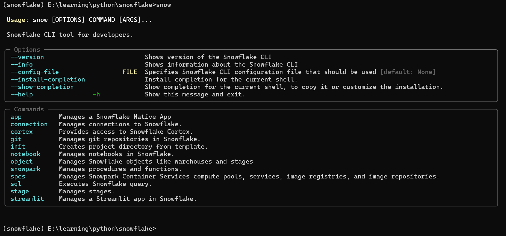

# Snowflake CLI
You can use snowflake commandline (CLI) to interact with snowflake from commandline. It gives a lot of power to use many functionalities of snowflake from commandline like working with app, connection, object as well as it let's you version control your snowflake project.

Below is the sample snowflake commands for snowflake CLI.



```Snowflake CLI
pip install snowflake-cli-labs

snow --help

snow --info

cd "/myuser/python/Application Support/snowflake/"

ls

vim config.toml

:q

cd ~

snow --help

snow app

snow --help

snow connection --help

snow --help

snow object --help
```