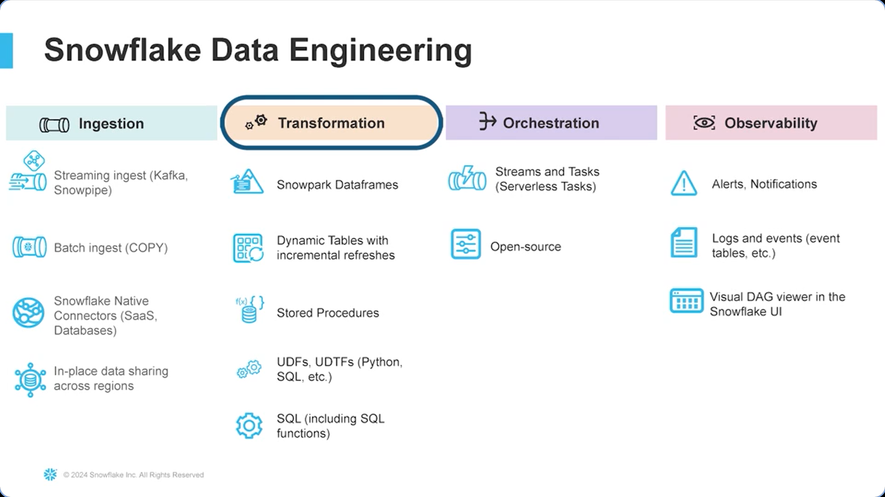

# Data Engineering
The reponsibility of data engineers is to ingest, transform and deliver data. Data engineers work with data scientists to use the data for various business use cases like reporting, analysis, GEN AI work loads etc.

## Introduction
Data ingestion is a big part of data engineering which deals with bringing data into Snowflake from external systems like flat file, databases, applications etc.

## Snowflake Data Engineering Overview
Snowflake Data Engineering can be categorised into below parts.
1. Ingestion
    1. Streaming ingest (Kafka, Snowpipe)
    1. Batch Ingest (COPY INTO)
    1. Snowflake Native Connectors (Saas, Databases)
    1. In-place data sharing across regions
1. Transformation
    1. Snowpark Dataframes
    1. Dynamic tables with incremental refreshes
    1. Stored Procedures
    1. UDFs and UDTFs (Pytho, SQL etc.)
    1. SQL (Including SQL functions)
1. Orchestration
    1. Streams and Tasks
    1. Open-Source (Apache Airflow)
1. Observability
    1. Alerts, Notifications
    1. Logs and Events (event tables etc.)
    1. Visual DAG viewer in Snowflake UI



## Snowpipe
Snowpipe is an automatic data ingestion tool from external storage providers like AWS, Azure, GCP etc. We will discuss about creating snowpipe with AWS S3.

First, you need to create an S3 bucket in your AWS account. Then, create a policy with appropriate permission. Use the policy create and create role. Add the role to your user.

```SQL
---> create the storage integration
CREATE OR REPLACE STORAGE INTEGRATION S3_role_integration
  TYPE = EXTERNAL_STAGE
  STORAGE_PROVIDER = S3
  ENABLED = TRUE
  STORAGE_AWS_ROLE_ARN = "arn:aws:iam::242141275:role/snowflake_role"
  STORAGE_ALLOWED_LOCATIONS = ("s3://intro-to-snowflake-snowpipe/");

---> describe the storage integration to see the info you need to copy over to AWS
DESCRIBE INTEGRATION S3_role_integration;

---> create the database
CREATE OR REPLACE DATABASE S3_db;

---> create the table (automatically in the public schema, because we didn’t specify)
CREATE OR REPLACE TABLE S3_table(food STRING, taste INT);

USE SCHEMA S3_db.public;

---> create stage with the link to the S3 bucket and info on the associated storage integration
CREATE OR REPLACE STAGE S3_stage
  url = ('s3://intro-to-snowflake-snowpipe/')
  storage_integration = S3_role_integration;

SHOW STAGES;

---> see the files in the stage
LIST @S3_stage;

---> select the first two columns from the stage
SELECT $1, $2 FROM @S3_stage;

USE WAREHOUSE COMPUTE_WH;

---> create the snowpipe, copying from S3_stage into S3_table
CREATE PIPE S3_db.public.S3_pipe AUTO_INGEST=TRUE as
  COPY INTO S3_db.public.S3_table
  FROM @S3_db.public.S3_stage;

SELECT * FROM S3_db.public.S3_table;

---> see a list of all the pipes
SHOW PIPES;

DESCRIBE PIPE S3_db.public.S3_pipe;

---> pause the pipe
ALTER PIPE S3_db.public.S3_pipe SET PIPE_EXECUTION_PAUSED = TRUE;

---> drop the pipe
DROP PIPE S3_pipe;

SHOW PIPES;
```


