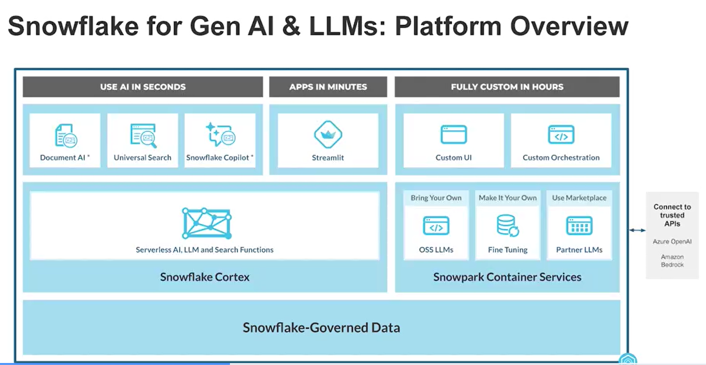

# Snowflake Gen AI & LLMs Platform
Snowflake provides Gen AI offerings below category.
1. Use AI in seconds
1. Apps in Minutes
1. Fully Custom in Hours

## Use AI in seconds
You have below features with this offering.
1. Document AI
1. Universal Search
1. Snowflake Copilot

### Document AI
You can use this feature to read a PDF document and write the data from it to a table. So, it let's you uncover the data in a corpus of PDF documents and perform analysis on it, that you have never been able to do before.

### Universal Search
It let's you search in Snowsight in natural language and provide insights to your query based on your data in your snowflake Account. Example "How can I forcast next year sales volume call?" search will provide you insights and also provide you the tables and documents that you can refer to find the information.

### Snowflake Copilot
Snowflake Copilot let's you create SQL queries based on your natural language instruction to it. Example "How to I find aggregate sales for last two years?" will give an appropriate SQL query.

## Apps in Minutes
You can use streamlit to achieve this. Streamlit is a powerful way of creating apps from Gen AI integration.

## Snowflake Cortex
Snowflake Cortex is the LLM engine that lets you perform above actions, Document AI, Universal Search, Snowflake Copilot, under that hood.


## Fully Custom in Hours
Under this offering you get below features under Snowpark Container Services.
1. Custom UI
1. Custom Orchesstration
1. Bring Your Own (OSS LLMs)
1. Make It Your Own (Fine Tuning)
1. Use Marketplace (Partner LLMs)



## Snowflake Cortex: Specialized LLM Functions
### SUMMARIZE
It performs fast summarization task that do not require any customization.

**_Syntax:_** SELECT SNOWFLAKE.CORTEX.SUMMARIZE(content) FROM reviews;

### SENTIMENT
Detects customer sentiment (Positive, Negative, Neutral)

**_Syntax:_** SELECT SNOWFLAKE.CORTEX.SENTIMENT(content) FROM reviews;

### EXTRACT_ANSWER
Extract Information from unstructured data in a Q&A format

**_Syntax:_** SELECT SNOWFLAKE.CORTEX.EXTRACT_ANSWER(review_content, 'What city this review is talking about?') FROM reviews;

### TRANSLATE
Extract Information from unstructured data in a Q&A format

**_Syntax:_** SELECT SNOWFLAKE.CORTEX.TRANSLATE(review_content, 'en', 'de') FROM reviews;

### COMPLETE
Below query provide a demonstration of using this function.

```SQL
ALTER ACCOUNT SET CORTEX_MODELS_ALLOWLIST = 'All';

ALTER ACCOUNT SET CORTEX_MODELS_ALLOWLIST = 'mistral-large2,llama3.1-70b';

SELECT CORTEX_MODELS_ALLOWLIST;

CALL SNOWFLAKE.MODELS.CORTEX_BASE_MODELS_REFRESH();

SHOW MODELS IN SNOWFLAKE.MODELS;

---> use the mistral-7b model and Snowflake Cortex Complete to ask a question
SELECT SNOWFLAKE.CORTEX.COMPLETE(
    'MISTRAL-7B', 'What are three reasons that Snowflake is positioned to become the go-to data platform?');

---> now send the result to the Snowflake Cortex Summarize function
SELECT SNOWFLAKE.CORTEX.SUMMARIZE(SNOWFLAKE.CORTEX.COMPLETE(
    'mistral-7b', 'What are three reasons that Snowflake is positioned to become the go-to data platform?'));

---> run Snowflake Cortex Complete on multiple rows at once
SELECT SNOWFLAKE.CORTEX.COMPLETE(
    'mistral-7b',
        CONCAT('Tell me why this food is tasty: ', menu_item_name)
) FROM FROSTBYTE_TASTY_BYTES.RAW_POS.MENU LIMIT 5;

---> check out what the table of prompts we’re feeding to Complete (roughly) looks like
SELECT CONCAT('Tell me why this food is tasty: ', menu_item_name)
FROM TASTY_BYTES.RAW_POS.MENU LIMIT 5;

---> give Snowflake Cortex Complete a prompt with history
SELECT SNOWFLAKE.CORTEX.COMPLETE(
    'mistral-7b', -- the model you want to use
    [
        {'role': 'system', 
        'content': 'Analyze this Snowflake review and determine the overall sentiment. Answer with just \"Positive\", \"Negative\", or \"Neutral\"' },
        {'role': 'user',
        'content': 'I love Snowflake because it is so simple to use.'}
    ], -- the array with the prompt history, and your new prompt
    {} -- An empty object of options (we're not specify additional options here)
) AS response;

---> give Snowflake Cortex Complete a prompt with a lengthier history
SELECT SNOWFLAKE.CORTEX.COMPLETE(
    'mistral-7b',
    [
        {'role': 'system', 
        'content': 'Analyze this Snowflake review and determine the overall sentiment. Answer with just \"Positive\", \"Negative\", or \"Neutral\"' },
        {'role': 'user',
        'content': 'I love Snowflake because it is so simple to use.'},
        {'role': 'assistant',
        'content': 'Positive. The review expresses a positive sentiment towards Snowflake, specifically mentioning that it is \"so simple to use.\'"'},
        {'role': 'user',
        'content': 'Based on other information you know about Snowflake, explain why the reviewer might feel they way they do.'}
    ], -- the array with the prompt history, and your new prompt
    {} -- An empty object of options (we're not specify additional options here)
) AS response;
```