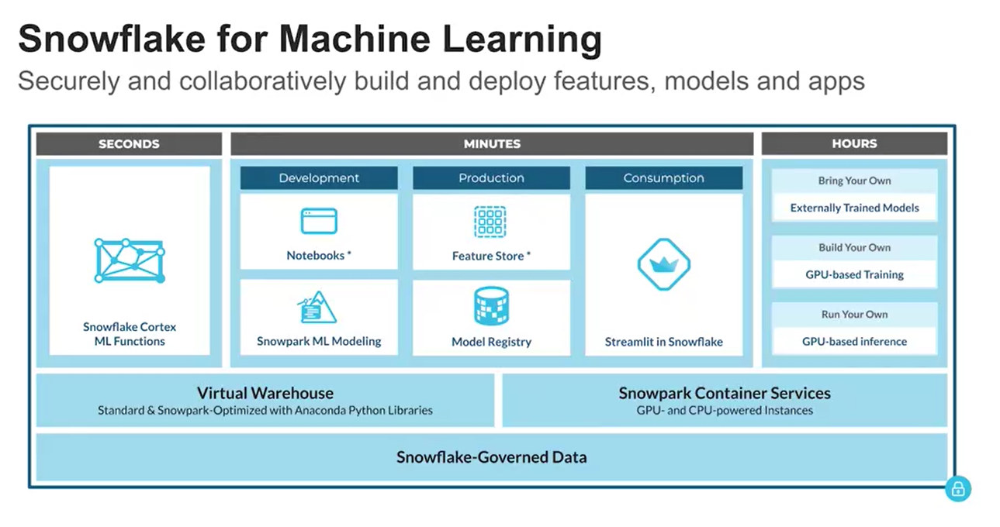
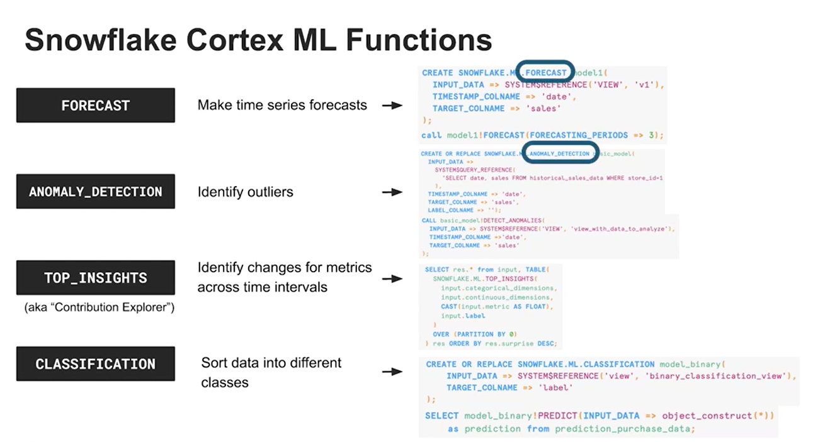

# Snowflake For Machine Learning
Snowflake machine learning can be categorized as below.
1. ML in Seconds
1. ML in Minutes
1. ML in Hours

## ML in Seconds
These are the features that can be used readily. Snowflake Cortext ML functions comes in this category. You have below Snowflake ML functions.
1. FORECAST (Make time series forecast)
1. ANOMALY_DETECTION (Identify outliers)
1. TOP_INSIGHTS (Identify changes for metrics across time intervals)
1. CLASSIFICATION (Sort data into different classes)

## ML in Minutes
It is categorized as below.
1. Development
1. Production
1. Consumption

### Development
1. Notebook
1. Snowpark ML Modeling

#### Notebook
Snowflake Notebook is similar to python notebook that data scientist use in and out. It is a notebook that uses Python, SQL and markdown. You can use python's powerful visualization libraries to visualize your data.

#### Snowpark ML Modeling
Snowpark ML Modeling enables machine learning model development directly within Snowflake. It allows data scientists to utilize popular Python ML frameworks like scikit-learn and XGBoost for feature engineering and model training, all while keeping the data within Snowflake's secure environment. This eliminates the need to move data out of Snowflake, enhancing security, governance, and leveraging Snowflake's performance and scalability.

### Production
1. Feature Store
1. Model Registry

#### Feature Store
Most of the time you would use few colums from one dataset for modelling and few columns from another dataset for inference etc. As the model grows bigger and complicated managing these dataset reference becomes difficult. So, Feature Store helps to better manage it. This is a store where you can save a dataset as variable that is referenced in a ML model.

#### Model Registry
You can register a model using python libraries like scikitlean and others to be able to use it execute in elastic compute from Snowflake.

! [Snowflake Machine Learning Model Registry](../images/snowflake_machine_learning_model_registry.png)

### Consumption
The model created using python script can be easily consumed by the end user without any additional work by using Streamlit. Streamlit converts python script to interactive and dynamic apps that can run on Snowflake's powerful and elastic compute.

## ML in Hours
Snowflake Container Service (SCS) provides complicated and fully customizable ML solutions wher you can customize both software and hardware.